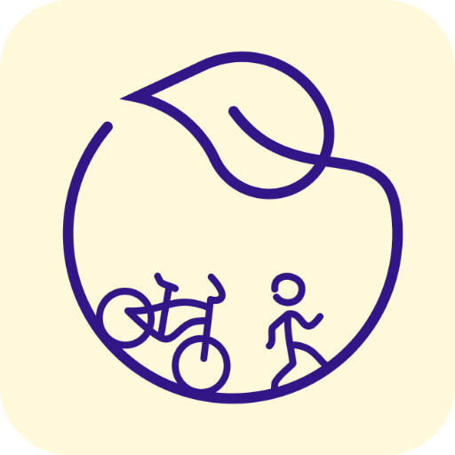

<p align="center">
  
</p>

<h2 align="center">🌍 Green Commute</h2>

<p align="center">A PWA for sustainable transport, team spirit, and a bit of friendly competition</p>

<p align="center">
  <a href="https://vickynygaard.github.io/Kortreist">Live Demo</a> • 
  <a href="https://web.dev/measure">
    
  </a>
</p>

---

## 🚀 About the App

**Green Commute** is a fast, offline-friendly Progressive Web App built with Next.js and .NET. It's designed for organizations or communities that want to **encourage eco-friendly transport habits** through **gamification, achievements, and team-based challenges**.

---

## ✨ Features

- ✅ **Register and sign in** with Azure AD B2C
- 🌱 **Log your transport** choices (walk, bike, carpool, bus, etc.)
- 🏆 **Earn achievements** and badges as you go
- 👥 **Join or create a team** and compete for the top spot
- 🧠 **Smart backend logic** with dynamic achievement tracking
- 🖼️ Custom **avatars and team pictures**
- 📊 **Scoreboard** with real-time team rankings
- ⚡️ Blazing fast transitions and offline support (PWA)
- 🎨 Beautifully styled with Tailwind CSS

---

## 🛠️ Tech Stack

- **Frontend**: [Next.js](https://nextjs.org/), [Tailwind CSS](https://tailwindcss.com/), [next-pwa](https://github.com/shadowwalker/next-pwa)
- **Backend**: ASP.NET Core Web API
- **Auth**: Azure AD B2C
- **Storage**: Azure + SQL

---

## 📦 Setup

```bash
# 1. Clone the repo
git clone https://github.com/your-org/green-commute.git

# 2. Install dependencies
npm install

# 3. Start the development server
npm run dev
